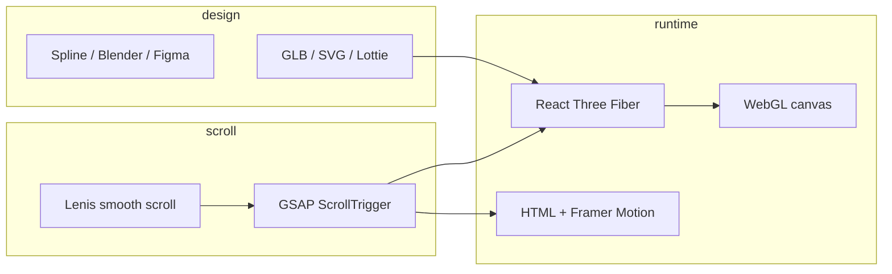

# Monadier design system & 3D motion guide

## Current stack (after refresh)

| Layer | Choice |
|--------|--------|
| Typography | **DM Sans** (400–700), slightly tight tracking via Tailwind `tracking-*` |
| Surfaces | **Glass** utilities: `.glass-nav`, `.glass-panel`, `.glass-card`, `.glass-effect` |
| Background | `MeshBackground` — mesh grid + animated aurora orbs |
| Motion (2D) | **Framer Motion** (already in repo) |
| Motion (scroll) | Recommended add: **Lenis** + **GSAP ScrollTrigger** |

Global tokens live in `tailwind.config.js` and `src/index.css`. Marketing headers use `glass-nav`.

---

## Glassmorphism rules (what “hyper modern” means here)

1. **Layered blur** — `backdrop-blur-xl` + semi-transparent fill (`white/5`–`white/8`), not flat `#141414` panels.
2. **Specular edge** — `border-white/10` plus optional `box-shadow` inset highlight (see `.glass-card::before`).
3. **Depth** — dark mesh behind UI; cards float above, not same color as page bg.
4. **Restraint** — one accent hue per section (indigo/violet/cyan in mesh only); UI stays monochrome.
5. **Performance** — limit full-viewport blur on mobile; `prefers-reduced-motion` disables orb animation.

---

## How to build a 3D motion site (scroll + vectors)

There is no single “3D plugin.” You combine **asset pipeline**, **runtime 3D**, and **scroll choreography**.

### Architecture



### Option A — Designer-friendly 3D (fastest)

- **Spline** (spline.design): model in browser, export React component or embed URL.
- **Pros**: beautiful hero objects, little code.
- **Cons**: bundle size, less control over scroll-linked transforms unless you use Spline events + GSAP.

### Option B — Full control (best for scroll-linked 3D)

1. Model vectors/3D in **Blender** → export **`.glb`** (Draco-compress for web).
2. **React Three Fiber** (`@react-three/fiber`) + **Drei** (`@react-three/drei`) in a fixed or section-scoped `<Canvas>`.
3. **GSAP ScrollTrigger** (or `@react-three/drei` `ScrollControls`) to drive:
   - camera position / `lookAt`
   - object rotation, scale, material opacity
   - section pin (`pin: true`) for “scrollytelling”
4. **Lenis** for smooth scroll; sync ScrollTrigger with Lenis in `useEffect`.

```bash
npm install three @react-three/fiber @react-three/drei gsap @studio-freight/lenis
```

Example pattern (conceptual):

```tsx
// Hero3D.tsx — section with pinned scroll
import { Canvas } from '@react-three/fiber';
import { useGLTF, ScrollControls, useScroll } from '@react-three/drei';
import { useFrame } from '@react-three/fiber';

function VaultModel() {
  const scroll = useScroll();
  const { scene } = useGLTF('/models/vault.glb');
  useFrame(() => {
    scene.rotation.y = scroll.offset * Math.PI * 2;
  });
  return <primitive object={scene} />;
}

export function Hero3D() {
  return (
    <div className="h-[300vh] relative">
      <div className="sticky top-0 h-screen">
        <Canvas camera={{ position: [0, 0, 5], fov: 45 }}>
          <ScrollControls pages={3} damping={0.2}>
            <VaultModel />
          </ScrollControls>
        </Canvas>
      </div>
    </div>
  );
}
```

### Option C — “2.5D” vectors (lighter, still premium)

- **SVG** paths animated with **GSAP** `drawSVG` or **Framer Motion** `pathLength`.
- **Rive** or **Lottie** for illustrated UI motion (not true 3D, but reads as dimensional with parallax).
- Layer **CSS `transform: translateZ()`** + `perspective` on scroll (parallax sections).

Good for Monadier: trading charts, vault diagram, fund flow — without shipping a full WebGL stack on every page.

### Option D — Shader / particles

- **three.js** particle field or custom shader background behind glass UI.
- Use sparingly on landing only; respect `prefers-reduced-motion`.

---

## Recommended rollout for Monadier

| Phase | Scope | Tools |
|-------|--------|--------|
| **1** (done) | Fonts, glass tokens, mesh bg | Tailwind, CSS, MeshBackground |
| **2** | Landing hero: parallax + staggered text | Framer Motion + `useScroll` |
| **3** | One pinned 3D section (“How vault works”) | Spline embed **or** single GLB + R3F |
| **4** | Dashboard stays flat/glass — no heavy WebGL | CSS only |

---

## Performance checklist

- One `<Canvas>` per viewport, not per card.
- `dpr={[1, 1.5]}` on mobile; disable 3D below `md` if needed.
- Lazy-load `Hero3D` with `React.lazy`.
- Compress GLB with Draco; target &lt; 2–5 MB per scene.
- Test on mid-range Android; thermal throttling kills WebGL quickly.

---

## Fonts: DM Sans vs Montserrat

- **DM Sans** — neutral, fintech-friendly, excellent UI sizes (current default).
- **Montserrat** — stronger geometric display feel; swap in `index.html` + `tailwind.config.js` `fontFamily` if you prefer more “brand poster” energy.

Tracking is controlled in Tailwind `letterSpacing` (`tight` ≈ `-0.02em`, `tighter` ≈ `-0.03em`).
